# 序言

AsgcJS 一款面向前端的开发工具包。

## 信息

- `原创作者`：傲世孤尘
- `开源协议`：MIT
- `当前版本`：v0.0.1
- `发布日期`：2018.06-08
- `交流Q群`527393872 

# 特性

- 纯原生Javascript实现，不依赖任何第三方框架
- 功能丰富，包含日志、缓存、UI等等常用的工具
- UI支持主题切换
- 对象化dom

# UI示例

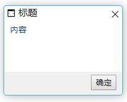

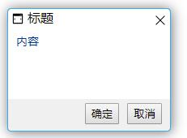

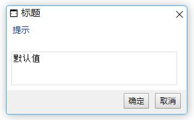

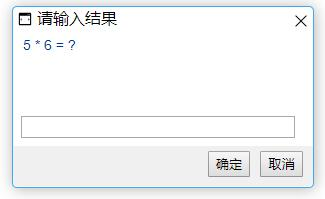

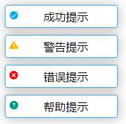

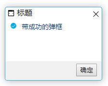

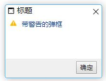

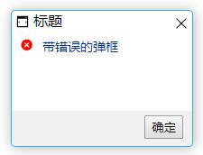

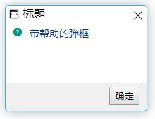

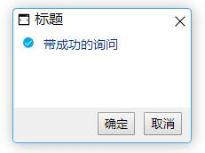

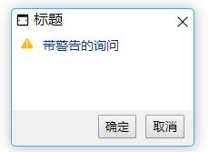

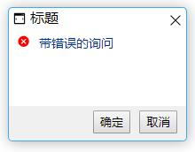

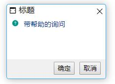

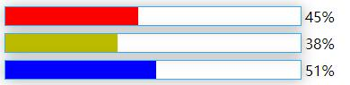

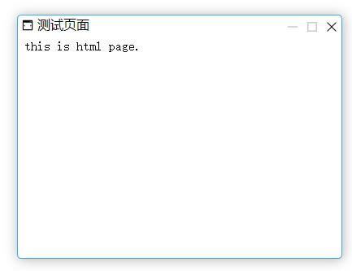

# 注意

它与本人发布的其他诸如asgc-cli、asgc-web等等不同，其他都是面向node服务端，而AsgcJS则完全面向于前端开发。

# 更新记录

2018-06-11 实现运行时主题切换、主题动态加载，解决msg内容溢出问题

2018-06-12 新增alert组件

2018-06-13 alert遮罩，防止忽略弹框做其他操作

2018-06-14 窗口支持拖拽移动位置、新增confirm组件、新增prompt组件

2018-06-15 alert、confirm、msg支持带图标、新增矩形加载框,修复右上角关闭按钮的一个bug、回调方法完美兼容经典形式与新的形式

2018-06-19 新增矩形进度条,prompt支持单行模式,prompt单行模式支持回车确定、新增htmlPage组件

2018-06-20 窗口支持八个方向鼠标拖拽改变大小