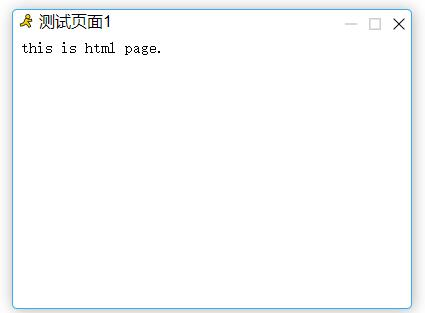

# 序言

AsgcJS 一款面向前端的开发工具包。

## 信息

- `原创作者`：傲世孤尘
- `开源协议`：MIT
- `当前版本`：v0.0.1
- `发布日期`：2018.06-08
- `交流Q群`527393872 

# 特性

- 纯原生Javascript实现，不依赖任何第三方框架
- 功能丰富，包含日志、缓存、UI等等常用的工具
- UI支持主题切换
- 对象化dom

# UI示例

# 注意

它与本人发布的其他诸如asgc-cli、asgc-web等等不同，其他都是面向node服务端，而AsgcJS则完全面向于前端开发。

# 更新记录

## 2018-06-11 
- 实现运行时主题切换
- 主题动态加载
- 解决msg内容溢出问题

## 2018-06-12 
- 新增alert组件

## 2018-06-13 
- alert遮罩，防止忽略弹框做其他操作

## 2018-06-14 
- 窗口支持拖拽移动位置
- 新增confirm组件
- 新增prompt组件

## 2018-06-15 
- alert、confirm、msg支持带图标
- 新增矩形加载框
- 修复右上角关闭按钮的一个bug
- 回调方法完美兼容经典形式与新的形式

## 2018-06-19 
- 新增矩形进度条
- prompt支持单行模式
- prompt单行模式支持回车确定
- 新增htmlPage组件

## 2018-06-20 
- 窗口支持八个方向鼠标拖拽改变大小
- 禁止窗口移出可视区域外
- 修复支持鼠标改变大小引起的显示异常
- 运行时根据窗口激活与非激活状态动态调整z-index与边框颜色

## 2018-06-21 
- 加入z-index GC机制，防止z-index无限叠加
- alert、confirm、prompt、htmlPage支持自定义图标

## 2018-07-06 
- 窗口激活体验优化
- 支持[ESC]按键关闭窗口

## 2018-07-11 
- 支持定位日志输出的位置

## 2018-07-20 
- 日志log增加阴影效果
- 禁止默认鼠标右键菜单
- 禁止图标拖拽
- 禁止窗口图标被选中

## 2018-07-23 
- 窗口支持最小化、最小化还原,最大化最小化状态下不允许改变大小

## 2018-07-24 
- 窗口最小化后，鼠标移动到边缘不会改变图标
- Class引入self解决this不一致的问题
- 窗口支持最大化

## 2018-07-25
- 鼠标移入移出窗口增加边框效果

## 2018-09-28
- HtmlPage样式优化，iframe去掉边框
- win10主题配置分离
- win10主题dependents从index.js中分离

# 待解决问题
- 最大化最小化引起的布局异常（按钮显示位置有误）
- 最大化最小化引起的事件异常（最小化后不允许最大化）
- 关闭、最大化、最小化配置控制不可见、可见不可用、可用
- 代码优化，默认显示全部从原始配置中取，同时兼容运行时改变。比如配置按钮可用，运行时可以修改为不可用
- HtmlPage包裹标签支持div、iframe，支持html字符串、本地url、第三方url、Element形式
- 新增ImageView弹出层